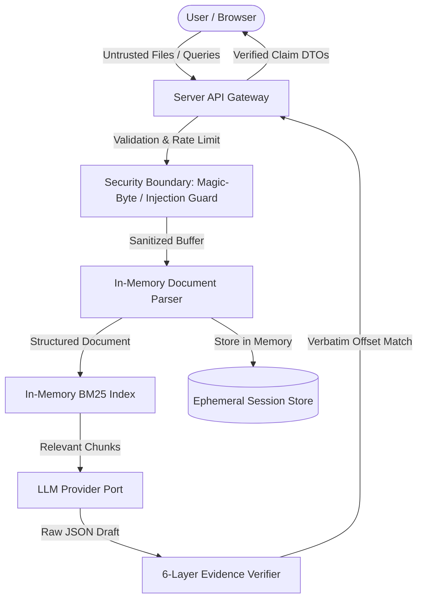

# LexiGuard Architecture & System Design

## 1. System Overview & Problem Statement

**LexiGuard** is an evidence-first legal document intelligence and action navigation system built for the **Prompt Wars | AI for Legal Assistance & Access** challenge.

Traditional "chat-with-PDF" tools suffer from critical failure modes in legal contexts:

- They hallucinate plausible-sounding legal advice, citations, or deadlines that do not exist.
- They blur the line between verified document text, derived inferences, and general legal opinion.
- They are vulnerable to indirect prompt injection embedded inside untrusted contracts.
- They fail to extract structured, actionable obligations into deadlines and consultation checklists.

LexiGuard solves these problems by treating the Large Language Model strictly as an untrusted analytical component bounded by deterministic parsing, lexical indexing, claim-level verification, and policy-driven severity rules.

---

## 2. Layered Architecture & Architectural Boundaries

LexiGuard strictly enforces unidirectional dependencies:

```
[UI / Presentation Layer]
          │
          ▼
[Application Services Layer]
          │
          ▼
[Domain Logic Layer]
          │
          ▼
[Infrastructure & Adapters Layer]
          │
          ▼
[External LLM Providers]
```

### Architectural Rules Enforced

1. **Zero Business Logic in Presentation**: React components receive validated domain data and emit typed UI events. They never call external providers, execute regex parsing, or manipulate raw file buffers.
2. **Domain Isolation**: Domain entities (`Document`, `Clause`, `AnalysisFinding`, `Obligation`, `ComparisonFinding`, `ActionPlan`) have zero dependencies on Next.js, React, or LLM SDKs.
3. **Provider Replaceability**: All AI operations depend on the `LLMProvider` port interface (`generateStructured<T>()` and `generateText()`). The primary live provider adapter is Google Gemini, and the mock provider runs 100% offline without credentials.
4. **Isolated Parsing & Retrieval**: Parsing (PDF, DOCX, TXT) and BM25 indexing are separated from LLM orchestration.
5. **Pre-Model Security Validation**: Magic-byte checks, decompression limits, and prompt sanitization execute _before_ parsing and model invocation.

---

## 3. Trust Boundaries & Security Enclaves



### Trust Boundary Definitions

- **Boundary 1 (Browser → Server)**: All HTTP requests are validated using strict Zod schemas with bounded body sizes (max 5 MB) and rate-limited via token bucket.
- **Boundary 2 (Uploaded File → Application)**: Uploaded files are untrusted binary data. Inspected via magic bytes (`%PDF-`, `PK\x03\x04`, clean UTF-8), bounded by decompressed archive quotas (max 20 MB, ratio < 10:1), and stripped of directory traversal sequences.
- **Boundary 3 (Document Text → LLM Prompt)**: Document content is treated as untrusted data. Wrapped in strict `<UNTRUSTED_DOCUMENT_CONTENT>` XML tags with instruction neutralization to prevent prompt injection and system override.
- **Boundary 4 (LLM Output → Application)**: Model output is treated as untrusted draft text. Validated against runtime Zod schemas with bounded retry budgets. Quoted evidence is verified verbatim against document character offsets.
- **Boundary 5 (Secrets & Environment)**: Centralized typed configuration (`src/infrastructure/config/env.ts`). Zero API keys are logged, serialized to client bundles, or embedded in prompts.

---

## 4. End-to-End Data Flow

```text
1. INGESTION:
   File Buffer -> Magic-Byte Check -> Normalization -> Safe Parsing -> Section & Clause Segmentation -> SHA-256 Hash

2. EVIDENCE INDEXING:
   Document Clauses -> BM25 Tokenizer & Frequency Indexer -> Clause Span Boundaries (startOffset, endOffset)

3. PROMPT FORMULATION:
   Prompt Template: <SYSTEM_INSTRUCTIONS> + <USER_GOAL> + <UNTRUSTED_DOCUMENT_CONTENT>

4. STRUCTURED GENERATION:
   LLMProvider Port -> Structured JSON Output (Zod Schema Validation)

5. CLAIM-LEVEL VERIFICATION:
   Draft Finding -> EvidenceVerifier -> Exact Substring & Offset Search -> Confidence Classification (DIRECTLY_STATED, STRONGLY_IMPLIED, NOT_FOUND)

6. DETERMINISTIC RISK POLICY:
   Auto-renewal < 30 days -> HIGH_ATTENTION
   Uncapped Liability -> HIGH_ATTENTION
   Late Penalties -> HIGH_ATTENTION
   Unilateral Modification -> REVIEW_SOON

7. ACTION SYNTHESIS:
   Obligations + Deadlines + Contextual Escalation Detection -> Immediate Action Checklist + Lawyer Preparation Sheet
```

---

## 5. Failure Modes & Graceful Degradation

| Failure Mode           | Root Cause                             | System Response & Mitigation                                                                                                                      |
| :--------------------- | :------------------------------------- | :------------------------------------------------------------------------------------------------------------------------------------------------ |
| **Malformed PDF**      | Corrupted binary, truncated stream     | Caught by `pdf-extractor.ts`; returns clean 400 `FileValidationError` without crashing process.                                                   |
| **Scanned/Image PDF**  | Document contains no extractable text  | Detects extracted chars < 100 on multi-page PDF; displays warning: _"Scanned or image-only document detected. Text extraction was insufficient."_ |
| **Prompt Injection**   | Contract contains jailbreak directives | XML delimiter tagging prevents model from executing document instructions; suspicious patterns flagged in UI.                                     |
| **LLM Schema Failure** | Model emits non-conforming JSON        | Bounded retry budget (max 2); falls back to safe error response without infinite retry loops.                                                     |
| **Hallucinated Quote** | Model asserts a clause not in document | `EvidenceVerifier` fails verbatim check; flags claim as `INSUFFICIENT_EVIDENCE` with confidence `NOT_FOUND`.                                      |
| **Provider Outage**    | External API network failure or 429    | Fails closed with descriptive 500 error; offline mock provider available via configuration (LLM_PROVIDER=mock).                                   |
| **DoS Flooding**       | Repeated rapid requests from client    | Token bucket rate limiter throttles to 30 req/min with `429 Too Many Requests` and `retryAfterSec`.                                               |

---

## 6. Testing Strategy

The repository employs a multi-tiered verification pyramid:

- **Unit Tests**: File magic bytes, filename traversal sanitization, clause segmentation, character offset alignment, evidence verification, token bucket rate limiting.
- **Integration Tests**: Ingestion-to-analysis pipeline, BM25 retrieval-to-answer pipeline, contract comparison diffing.
- **Security Regression Tests**: Direct injection, indirect injection, XML framing breakouts, system prompt leakage, ZIP bombs, path traversal.
- **Accessibility Audits**: Automated `axe-core` compliance checks on all primary components.
- **AI Evaluation Harness**: Measurable benchmark testing citation accuracy, evidence grounding verification, omission rate, and legal boundary compliance.
- **Playwright E2E**: Critical journey testing from upload to evidence inspection, modal focus management, and action plan export.
